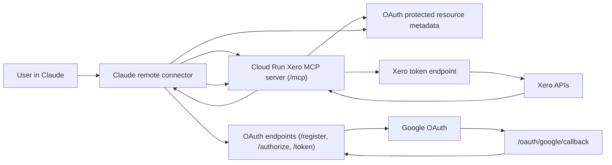

# Remote MCP Architecture For Xero

This document captures how the hosted remote MCP pattern used in `../cin7-mcp-server` applies to this Xero MCP server.

## Verdict

Yes, the same hosted shape will work for this server if the deployment is intended to access a single Xero organisation per service using a Xero Custom Connection.

That fits this codebase well because the current Xero integration already supports server-held upstream credentials via:

- `XERO_CLIENT_ID`
- `XERO_CLIENT_SECRET`

Important limitation:

- this hosted pattern does **not** make the server multi-tenant across arbitrary end-user Xero organisations
- it is a good fit for one Xero org per deployed service
- if you want each user to connect their own Xero tenant, that would require a separate Xero user OAuth flow and tenant-selection layer

## Recommended Hosted Shape

Use the same overall pattern as Cin7:

- public `Cloud Run` service
- `Artifact Registry` container image
- `Secret Manager` for Xero credentials and OAuth secrets
- app-level OAuth on the MCP server itself
- `Google` as the human identity provider
- Claude remote connector calling `/mcp`

Like the Cin7 deployment, the final `/mcp` path should stay public and be protected by app-layer OAuth, not `IAP`.

## Why This Works For Xero

The current Xero server has two upstream credential modes:

- `XERO_CLIENT_ID` + `XERO_CLIENT_SECRET`
- `XERO_CLIENT_BEARER_TOKEN`

For hosted remote MCP, the correct fit is `XERO_CLIENT_ID` + `XERO_CLIENT_SECRET`.

Why:

- Custom Connections are server-to-server credentials
- the server can mint Xero access tokens on demand without user interaction
- Google Workspace auth can be used only to control which humans may use the MCP server

The bearer-token mode is less suitable for a hosted service because:

- the token must be obtained elsewhere
- token refresh/rotation is outside the server
- operationally it is more brittle than using the Xero client credentials directly

## Runtime Flow



## Server Endpoints

When `MCP_TRANSPORT=http`, the server exposes:

- `/mcp`
- `/.well-known/oauth-protected-resource/mcp`
- `/.well-known/oauth-authorization-server`
- `/register`
- `/authorize`
- `/token`
- `/revoke`
- `/oauth/google/callback`
- `/health`
- `/healthz`

## Required Hosted Environment

### MCP Transport/Auth

```env
MCP_TRANSPORT=http
MCP_HTTP_AUTH_MODE=oauth
MCP_PUBLIC_BASE_URL=https://<service-url>
MCP_HTTP_HOST=0.0.0.0
MCP_HTTP_PORT=8080
MCP_HTTP_PATH=/mcp
MCP_UPLOAD_PATH=/mcp/uploads
MCP_STAGED_UPLOAD_URL_STYLE=mcp-query
MCP_STAGED_UPLOAD_TEMP_DIR=/tmp/cowork-xero-uploads
MCP_STAGED_UPLOAD_MAX_BYTES=10485760
MCP_STAGED_UPLOAD_TTL_SECONDS=900
MCP_STAGED_UPLOAD_SIGNING_SECRET=...
MCP_OAUTH_SIGNING_SECRET=...
MCP_OAUTH_SCOPES=xero.mcp
GOOGLE_OAUTH_CLIENT_ID=...
GOOGLE_OAUTH_CLIENT_SECRET=...
GOOGLE_OAUTH_HOSTED_DOMAIN=futuratrailers.com
GOOGLE_OAUTH_ALLOWED_EMAIL_DOMAIN=futuratrailers.com
```

### Xero Upstream Credentials

```env
XERO_CLIENT_ID=...
XERO_CLIENT_SECRET=...
```

## Suggested Secret Names

For `futuratrailers-mcp-prod`, a clean set of Secret Manager entries would be:

- `xero-client-id`
- `xero-client-secret`
- `google-oauth-client-id`
- `google-oauth-client-secret`
- `mcp-oauth-signing-secret`

## Google OAuth Setup

Create a Google web OAuth client in the same Google Cloud project and set the callback URI to:

- `https://<service-url>/oauth/google/callback`

For your current org boundary, the intended restriction is:

- hosted domain hint: `futuratrailers.com`
- allowed email domain: `futuratrailers.com`

## Deployment Notes

This repo now includes a `Dockerfile` suitable for Cloud Run.

Typical flow:

1. Build and push the image with `gcloud builds submit`.
2. Deploy to Cloud Run with public ingress.
3. Set non-secret env vars directly.
4. Inject secret-backed env vars from Secret Manager.
5. Configure Claude to use `https://<service-url>/mcp` as the remote connector URL.

Cloud Run settings similar to Cin7 should be fine as a starting point:

- ingress: public
- auth: app-layer OAuth, not `IAP`
- min instances: `0`
- max instances: `3`
- concurrency: `10`
- memory: `512Mi`
- cpu: `1`
- timeout: `300`

For hosted file uploads, use the staged upload pattern in
[`STAGED_FILE_UPLOADS.md`](STAGED_FILE_UPLOADS.md). The first implementation can
use local temp storage for low usage, but `max instances = 1` is recommended
until shared object storage is introduced.

## What Was Added In This Repo

The initial hosted-connector support in this repo now includes:

- `stdio` and `http` transport selection
- streamable HTTP MCP endpoint support
- static bearer or Google-backed OAuth protection for HTTP
- stateless signed-token OAuth implementation for MCP clients
- Docker packaging for Cloud Run

## What Is Still Out Of Scope

The current implementation still assumes one Xero org per deployment.

Not included yet:

- per-user Xero OAuth login
- dynamic Xero tenant selection
- revocation backed by a database
- group-based Google authorization beyond domain restriction
